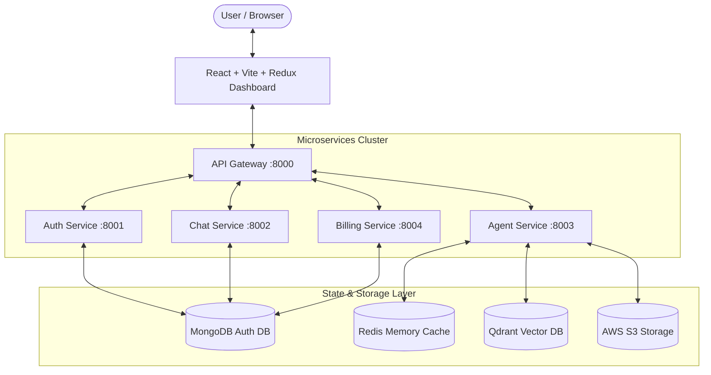

# CortexAI - Autonomous Multi-Agent AI Platform

**Author**: `kiran p`  
**License**: ISC  
**Architecture**: Microservices (Event-Driven / LangGraph Multi-Agent Orchestration)

---

## 🌟 Executive Summary

**CortexAI** is an end-to-end, enterprise-grade multi-agent artificial intelligence platform. Built on a modular microservices architecture, CortexAI leverages modern LLM orchestration using **LangGraph**, **LangChain**, and high-performance cloud infrastructure including **AWS S3** for persistent media and document storage, **Qdrant Vector Database** for RAG capabilities, and **Redis** for distributed state and caching.

---

## 🏗️ Architecture Overview



---

## 🤖 Specialized AI Agents

CortexAI routes user requests dynamically via an intelligent **StateGraph Router** to specialized domain agents:

| Agent Name | Description | Key Technologies |
| :--- | :--- | :--- |
| **Chat Agent** | Conversational agent supporting multi-turn memory & web context | Groq / Gemini, Redis Memory |
| **Coding Agent** | Full-stack project code generator & code review suite | LangChain LLM, Unsplash API |
| **PDF Generator Agent** | Automated structured PDF document generator | PDFKit, AWS S3 Storage |
| **PPT Generator Agent** | Automated 16:9 presentation slide deck builder | PPTXGenJS, AWS S3 Storage |
| **Vision Agent** | Ultra-realistic 8K image prompt generator & renderer | Pollinations AI, AWS S3 |
| **PDF RAG Agent** | Document Q&A over uploaded PDFs using Vector RAG | PDFParse, Qdrant Vector DB |
| **Image Analyzer** | Multimodal OCR and visual chart/image analyzer | Vision LLM Models |
| **Search Agent** | Live web search engine agent with real-time citations | Tavily Search API |

---

## 📦 Service Breakdown & Ports

| Service | Port | Description |
| :--- | :--- | :--- |
| `frontend` | `5173` | React 19 + Vite dashboard with code editor, Markdown renderer, and chat interface |
| `gateway` | `8000` | Central routing gateway handling CORS, authentication headers, and reverse proxying |
| `auth` | `8001` | Firebase Admin SDK integration, JWT verification, and user management |
| `chat` | `8002` | Persistent conversation logs, history storage, and message payload management |
| `agent` | `8003` | Core LangGraph agent execution graph, S3 uploaders, and credit deductions |
| `billing` | `8004` | Credit system, plan subscriptions, and Razorpay payment gateway integration |

---

## ⚙️ Environment Configuration

Each backend service contains an independent `.env` file. Below are the required keys:

### 1. Agent Service (`backend/services/agent/.env`)
```env
PORT=8003
MONGODB_URI="your_mongodb_uri"
GROQ_API_KEY="your_groq_api_key"
GOOGLE_API_KEY="your_google_api_key"
CHAT_SERVICE="http://localhost:8002"
AUTH_SERVICE="http://localhost:8001"
REDIS_URL="redis://localhost:6379"

TAVILY_API_KEY="your_tavily_api_key"
OPENROUTER_API_KEY="your_openrouter_api_key"

AWS_REGION="ap-south-1"
AWS_ACCESS_KEY_ID="your_aws_access_key_id"
AWS_SECRET_KEY="your_aws_secret_key"
AWS_BUCKET_NAME="your_aws_bucket_name"

QDRANT_API_KEY="your_qdrant_api_key"
QDRANT_URL="your_qdrant_url"
```

### 2. Gateway Service (`backend/gateway/.env`)
```env
PORT=8000
AUTH_SERVICE="http://localhost:8001"
CHAT_SERVICE="http://localhost:8002"
AGENT_SERVICE="http://localhost:8003"
BILLING_SERVICE="http://localhost:8004"
```

---

## 🚀 Quick Start Guide

### Prerequisites
- Node.js >= 18.x
- Docker & Docker Compose (Optional, for containers & Redis)
- MongoDB instance (Atlas or Local)

### 1. Installation

Clone the repository and install dependencies across services:

```bash
# Clone the repository
git clone https://github.com/<your-username>/1.cortexAI.git
cd 1.cortexAI

# Install frontend dependencies
cd frontend && npm install

# Install backend microservices dependencies
cd ../backend/gateway && npm install
cd ../services/agent && npm install
cd ../services/auth && npm install
cd ../services/billing && npm install
cd ../services/chat && npm install
```

### 2. Running via Docker Compose

```bash
cd backend
docker compose up -d
```

### 3. Running Services Locally

Start microservices in separate terminals:

```bash
# Terminal 1: Gateway
cd backend/gateway && npm run dev

# Terminal 2: Agent Service
cd backend/services/agent && npm run dev

# Terminal 3: Auth Service
cd backend/services/auth && npm run dev

# Terminal 4: Chat Service
cd backend/services/chat && npm run dev

# Terminal 5: Billing Service
cd backend/services/billing && npm run dev

# Terminal 6: Frontend UI
cd frontend && npm run dev
```

---

## 🛠️ Key Fixes Implemented

1. **AWS S3 Storage Integration & Presigned URLs**:
   - Resolved credential resolution across standard `AWS_SECRET_KEY` and `AWS_SECRET_ACCESS_KEY` environment variables.
   - Enhanced signed URL generation with customizable expiration limits for presentation downloads, generated documents, and vision assets.
2. **Robust LLM JSON Parsing**:
   - Added `parseJsonResponse` helper utility to strip markdown code blocks (` ```json ... ``` `) and safely extract JSON data structures, eliminating unexpected `SyntaxError` failures during document/slide deck generation.
3. **Comprehensive Error Reporting**:
   - Updated catch blocks across all LangGraph agents to propagate exact error messages instead of defaulting to `"failed to give respond"`.
4. **Author Metadata**:
   - Set author attribution across all service manifest files (`package.json`), PDFKit document metadata, and PPTXGenJS presentation attributes to **`kiran p`**.

---

## 👤 Author

**Kiran P**  
- Primary Developer & Maintainer of CortexAI  
- Platform Lead & AI Systems Architect  
